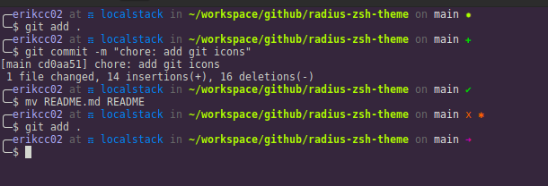

# radius-zsh-theme

Theme for ZSH inspired by 'fino'

* Supports git
* Supports [desk](https://github.com/jamesob/desk)



Listed in [awesome-zsh-plugins](https://github.com/unixorn/awesome-zsh-plugins)

## Installation

Download the repository in your custom themes:

```bash
git clone https://github.com/erikcc02/radius-zsh-theme.git $ZSH_CUSTOM/themes/radius-zsh-theme
```
Create a symbolic link:

```bash
ln -s $ZSH_CUSTOM/themes/radius-zsh-theme/radius.zsh-theme $ZSH/themes/
```

Change `ZSH_THEME` in .zshrc to `ZSH_THEME=radius`

## License

[Read More](./LICENSE)
